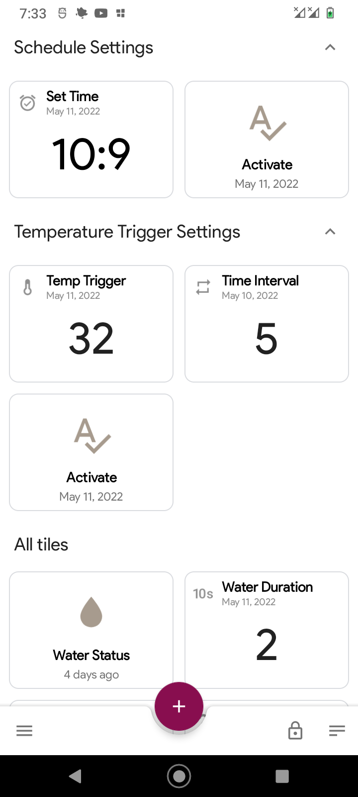
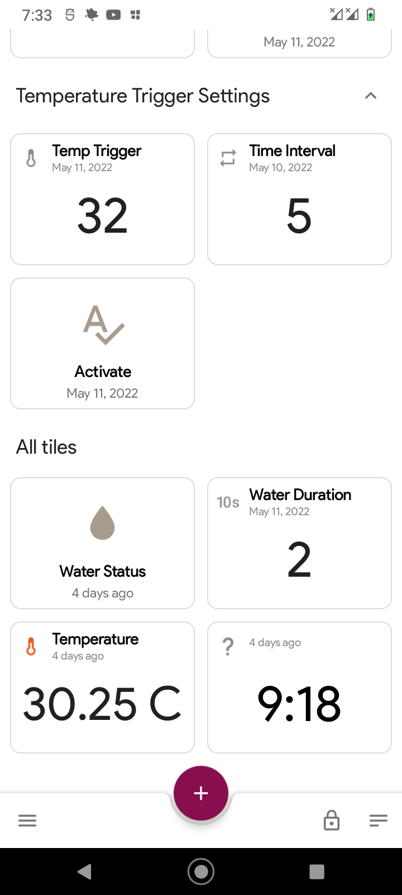

# Automatic Irrigation
A cheap and functional water irrigation system for farmers. It is originally designed for oyster mushroom irrigation but can also be use for other indoor and outdoor crops.

## Features
1. NodeMCU MQTT server
2. ESP01 MQTT client
3. Manual water on/off
4. Set timer for auto-off water
5. Set time schedule to auto-on water
6. Temperature triggered water on

## Hardware requirements
- Nodemcu V3 (as MQTT Server)
- ESP01 (for clients)
- 12v PSU
- DS3231 RTC Module
- 12v Water Solenoid
- Water soleniod 12v

## Software requirements
- MQTT Dashboard (Android)